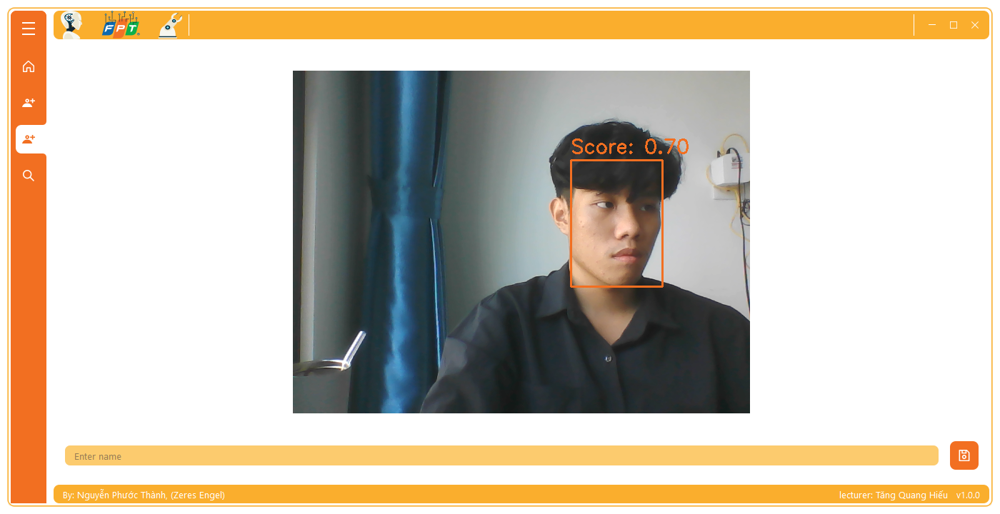

# FPT VISION

<div>
  <p align="center">
     
  </p>
</div>

Welcome to FPT Vision, an application built using the QT library that combines the power of facial detection and recognition. With the utilization of the RetinaFace model for facial detection and the Iresnet100 and ArcFace models for facial recognition, FPT Vision provides accurate and efficient face labeling and recognition capabilities.

This application allows users to label names for faces captured through a camera or images, enabling the creation of labeled datasets for training and identification purposes. Additionally, FPT Vision leverages the camera to perform real-time face recognition, providing instant identification and verification.

With a user-friendly interface, FPT Vision offers seamless interaction and intuitive controls for capturing, labeling, and recognizing faces. The advanced deep learning techniques employed by FPT Vision ensure reliable and precise results, enabling users to effectively organize and analyze face-related data.

Make the most of FPT Vision to streamline your face labeling and recognition tasks, whether it's for security, identification, or personalized applications. Feel empowered with this powerful tool that harnesses the capabilities of QT, RetinaFace, Iresnet100, and ArcFace to enhance your facial analysis workflows.

<p align="center">
  
  
  
  
  <a href="https://github.com/Zeres-Engel"></a>
</p>

# Table of Content
- [Overview](#overview)
- [Operational Principles](#operational-principles)
- [Deploying the Product](#deploying-the-product)
    - [User Interface](#user-interface)
    - [Configuration](#configuration)

## Overview

The application allows users to label faces by entering names in the text bar. The model performs facial detection and applies a normalization crop to the detected faces. It then saves the cropped face images into a directory with the same name as the entered name. Additionally, the application performs facial recognition on the detected faces.

  

## Operational Principles

The application utilizes the RetinaFace model for facial detection, which accurately locates faces in the input images. Additionally, it performs landmark detection to identify five key facial landmarks: the two eyes, the nose, and the two mouth corners.

After detecting the facial landmarks, the application extracts the corresponding facial regions and transforms them into feature vectors using the Iresnet100 and ArcFace models. These feature vectors capture the unique characteristics of each face.

To perform recognition, the application compares the feature vectors of the detected faces using cosine similarity. Cosine similarity measures the similarity between two vectors by calculating the cosine of the angle between them. By comparing the feature vectors, the application determines the degree of similarity between faces and performs recognition accordingly.

  

## Deploying the Product

Our face recognition application is designed to provide accurate and efficient face detection, landmark detection, and recognition capabilities. It leverages advanced deep learning models, including RetinaFace for face detection, Iresnet100 and ArcFace for face recognition, and landmark detection algorithms to ensure precise alignment.

The application allows users to label faces by providing names and performs recognition by comparing the extracted feature vectors using cosine similarity. It provides seamless integration with cameras and image inputs, making it suitable for real-time face recognition applications.

  ### User Interface

  The user interface of our face recognition application is designed to provide an intuitive and seamless experience for users. It incorporates three main features, each offering specific functionality:

  * Feature 1: Image Labeling

  This feature allows users to select a JPG image file and enter a name for the face found in the image. The application will save the cropped face image with the entered name below the text bar. It's important to note that this feature is designed for images with only a single face.

  

  * Feature 2: Camera Face Labeling

  With this feature, users can open the camera and perform face labeling through the camera input. By entering a name in the text bar, the application will label the face detected with the largest bounding box and display it within the application.

  

  * Feature 3: Camera Face Recognition

  The final feature utilizes the camera input to detect faces and display the names of the faces based on the previously aligned faces stored in the "Aligned" directory. If no matching directory is found for the detected faces in the "Aligned" directory, the application will label them as "Unknown".

  

  ### Configuration

  To run the FPT Vision application, follow the steps below:

  1. Install Dependencies:
    Make sure you have the required dependencies installed in your environment. You can install them by running the following command:
      ```shell
      pip install -r requirements.txt
      ```

  2. Run the Application:
    Once the dependencies are installed, you can run the application using the following command:
      ```shell
      python main.py
      ```